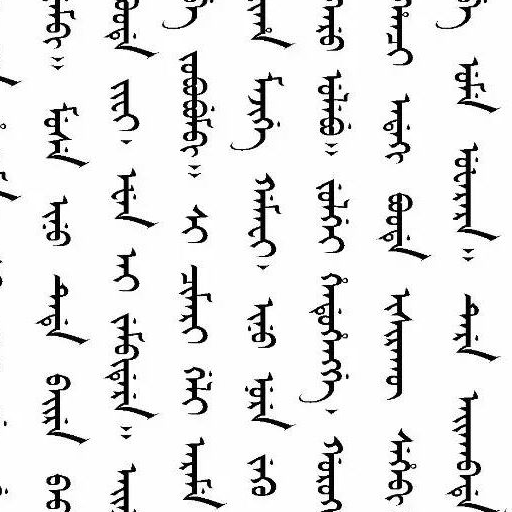
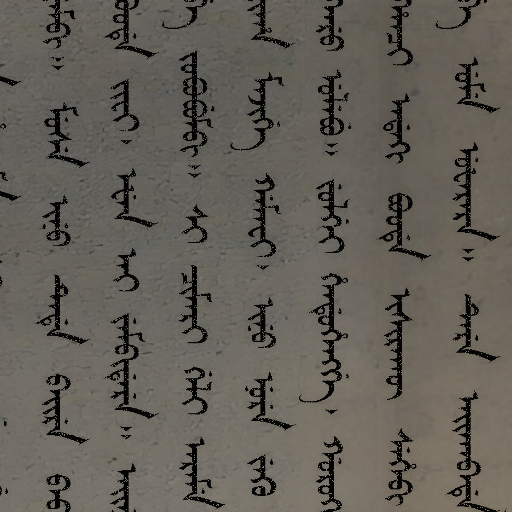
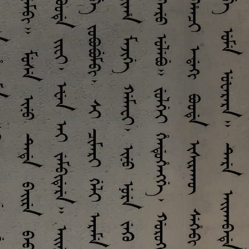
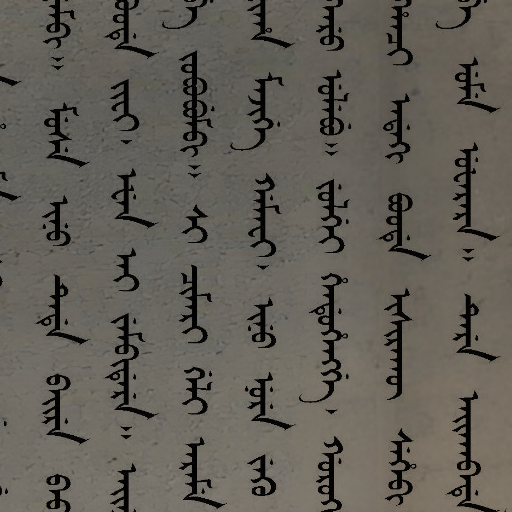

# Manchu Degradation Simulator

A lightweight repository for simulating degradation effects on Manchu document images.

This project was extracted from a larger Manchu OCR and restoration system. It focuses on one reusable part of that work: generating synthetic degradation samples for ancient document research, restoration experiments, and demo data preparation.

## Project Background

This repository comes from our broader work on Manchu ancient document recognition and restoration. During that project, we built a separate degradation simulation pipeline to synthesize damaged document samples for data generation, visual demos, and restoration-model training preparation.

## What It Includes

- Background and foreground fusion for clean Manchu text images
- Basic image degradation effects
  - Gaussian blur
  - JPEG artifacts
  - brightness / contrast perturbation
- Text-aware degradation effects
  - missing-style text dropout
  - irregular broken-text damage with procedural masks
- A small dataset sampling script for building lightweight subsets

## Example Effects

Clean input:



Missing-style text degradation (`miss`-like effect):



Irregular damage / broken text effect:



Fused paper-text example:



## Repository Structure

```text
.
├─ src/
│  ├─ __init__.py
│  ├─ degradation_functions.py
│  ├─ text_degradations.py
│  ├─ advanced_text_damage.py
│  └─ advanced_degradations.py
├─ examples/
├─ run_demo.py
├─ sample_manchu_dataset.py
├─ requirements.txt
├─ LICENSE
└─ README.md
```

## Environment

Recommended: Python 3.10+

```bash
pip install -r requirements.txt
```

## Quick Start

Prepare:

- one clean Manchu text image
- one paper/background texture image

Run:

```bash
python run_demo.py \
  --clean path/to/clean.png \
  --background path/to/background.png \
  --output demo_output
```

The script will generate:

- `clean.png`
- `background.png`
- `fused.png`
- `blur.png`
- `jpeg_artifacts.png`
- `brightness_contrast.png`
- `pepper_text_dropout.png`
- `advanced_text_damage.png`

## Core Modules

### `src/degradation_functions.py`

Basic image-level degradation utilities:

- Gaussian blur
- JPEG artifacts
- brightness / contrast perturbation

### `src/text_degradations.py`

Text-region degradation utilities:

- extract text masks from clean images
- apply dropout-like pepper damage to text regions

### `src/advanced_text_damage.py`

Procedural text damage generation:

- generate irregular masks with OpenSimplex noise
- apply background replacement inside text regions

### `src/advanced_degradations.py`

Additional advanced degradation logic for more complex local damage patterns.

## Dataset Sampling

If you already have a full `manchu_dataset`, you can create a smaller subset with:

```bash
python sample_manchu_dataset.py \
  --src path/to/manchu_dataset \
  --dst path/to/manchu_dataset_sample \
  --num 20 \
  --seed 42 \
  --overwrite
```

## Notes

- This repository contains the degradation simulation core only.
- OCR, model training, and large experimental outputs are intentionally excluded.
- Some original source comments came from legacy files with encoding issues. The code is still runnable, but future cleanup is recommended if this repo will be maintained long-term.
- `advanced_text_damage.py` and `advanced_degradations.py` require `opensimplex` and `perlin-noise`.

## Suggested Next Steps

- wrap all degradations into a unified CLI
- add config-driven batch generation
- expose optional degradation masks for restoration training
- add a few more public demo samples for each degradation type
